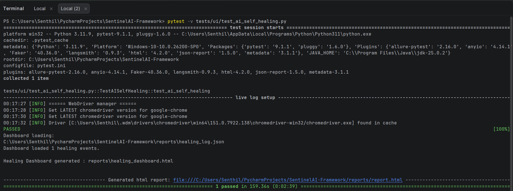
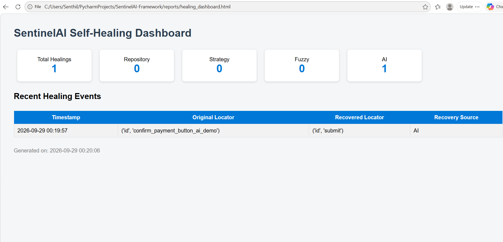
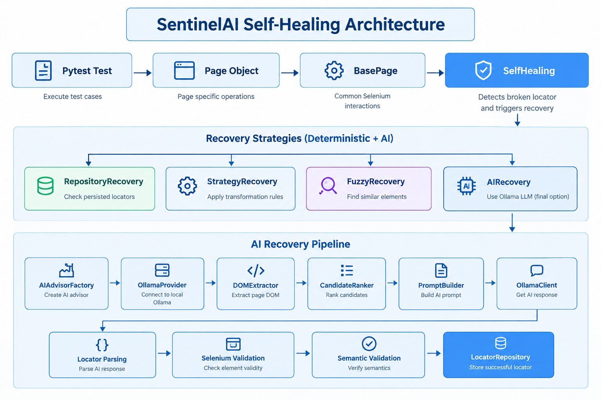

# SentinelAI Framework

AI-Assisted Selenium Self-Healing Test Automation Framework

SentinelAI is a Python-based Selenium and PyTest automation framework that demonstrates layered self-healing for broken UI locators.

When a locator becomes invalid, the framework attempts recovery in the following order:

1. **Repository Recovery**
2. **Strategy Recovery**
3. **Fuzzy Recovery**
4. **AI Recovery using a local Ollama LLM**

The AI recovery layer is used as the final recovery mechanism after the deterministic recovery strategies cannot recover the element.

---

## Project Overview

The framework combines:

* Python
* Selenium WebDriver
* PyTest
* Page Object Model
* Layered self-healing
* Local Ollama LLM integration
* Locator repository persistence
* Healing logs
* HTML healing dashboard
* PyTest HTML reporting
* Allure reporting

The primary purpose of the project is to demonstrate how AI-assisted recovery can be integrated into a conventional Selenium automation framework without replacing deterministic automation strategies.


---
## Demo

### AI Self-Healing Execution



### Healing Dashboard



### Self-Healing Architecture



---
# Architecture

```text
PyTest Test
     │
     ▼
Page Object
     │
     ▼
BasePage / Selenium interaction
     │
     ▼
Self-Healing Orchestrator
     │
     ├── Repository Recovery
     │
     ├── Strategy Recovery
     │
     ├── Fuzzy Recovery
     │
     └── AI Recovery
             │
             ▼
       AIAdvisorFactory
             │
             ▼
       OllamaProvider
             │
             ▼
        DOMExtractor
             │
             ▼
       CandidateRanker
             │
             ▼
        PromptBuilder
             │
             ▼
        OllamaClient
             │
             ▼
      Locator Suggestion
             │
             ▼
       Locator Validation
             │
             ▼
      Semantic Validation
             │
             ▼
      Locator Repository
```

## Recovery Strategy

The framework intentionally places AI recovery after deterministic mechanisms.

```text
Broken Locator
      │
      ▼
Repository Recovery
      │
      ├── success ──► Continue Test
      │
      ▼
Strategy Recovery
      │
      ├── success ──► Continue Test
      │
      ▼
Fuzzy Recovery
      │
      ├── success ──► Continue Test
      │
      ▼
AI Recovery
      │
      ▼
Validate Recovered Locator
      │
      ├── valid ──► Continue Test
      │
      └── invalid ──► Recovery Failure
```

This design keeps the faster and deterministic recovery mechanisms ahead of the LLM-based mechanism.

---

# Self-Healing Components

## 1. Repository Recovery

The repository recovery mechanism checks the persisted locator knowledge before invoking other recovery mechanisms.

The repository is stored in:

```text
repository/
└── locator_repository.json
```

A successfully recovered locator can be persisted for subsequent executions.

The repository stores information such as:

* Original locator
* Alternative locator
* Recovery source
* Success count
* Failure count
* Confidence
* Last-used information

---

## 2. Strategy Recovery

Strategy recovery applies predefined locator transformation rules.

Examples include alternative locator strategies based on:

* ID
* Name
* CSS
* XPath
* Other known page attributes

This layer does not require an LLM.

---

## 3. Fuzzy Recovery

Fuzzy recovery attempts to identify a suitable element by comparing characteristics of the available DOM elements.

The recovery process can consider information such as:

* Element attributes
* Tag names
* Visible text
* DOM similarity
* Element relationships

---

## 4. AI Recovery

AI recovery is the final recovery layer.

The active implementation uses a locally hosted **Ollama** model.

The AI recovery flow is:

```text
Broken Locator
      │
      ▼
DOM Extraction
      │
      ▼
Candidate Ranking
      │
      ▼
Prompt Construction
      │
      ▼
Ollama LLM
      │
      ▼
Locator Suggestion
      │
      ▼
Locator Validation
      │
      ▼
Semantic Validation
      │
      ▼
Persist Successful Locator
```

The framework therefore does not blindly accept an LLM-generated locator.

The proposed locator is validated before it is used by the test.

---

# AI Recovery Implementation

The current AI recovery path includes:

```text
AIRecovery
    │
    ▼
AIAdvisorFactory
    │
    ▼
OllamaProvider
    │
    ├── DOMExtractor
    ├── CandidateRanker
    ├── PromptBuilder
    └── OllamaClient
```

The Ollama configuration is maintained in:

```text
utils/ai_config.py
```

The configuration supports the local Ollama endpoint and model configuration.

The current default model configuration is:

```text
llama3:8b
```

The framework therefore does not depend on OpenAI API access for its AI recovery implementation.

---

# Deterministic AI Self-Healing Demonstration

The project contains two important self-healing demonstrations.

## `test_self_healing.py`

This test demonstrates the deterministic recovery mechanisms:

```text
Repository
     ↓
Strategy
     ↓
Fuzzy
```

It is designed to demonstrate the first three recovery layers and does not intentionally force execution into AI recovery.

---

## `test_ai_self_healing.py`

This test specifically demonstrates the final AI recovery layer.

Before execution, the test clears the persisted locator repository:

```python
LocatorRepository.clear_repository()
```

This prevents previously learned locators from allowing Repository Recovery to succeed before the AI demonstration.

The test then deliberately causes the earlier deterministic recovery mechanisms to fail so that execution reaches:

```text
AI Recovery
```

This makes the AI self-healing demonstration independent of locator state left by previous executions.

### Latest targeted validation

```text
1 passed
0 warnings
```

The execution also generated:

```text
reports/healing_log.json
reports/healing_dashboard.html
reports/report.html
```

The healing log reported one healing event during the targeted AI self-healing execution.

---

# Locator Repository Learning

Successful recovered locators can be persisted in:

```text
repository/locator_repository.json
```

The general lifecycle is:

```text
Broken Locator
      ↓
Recovery
      ↓
Locator Validation
      ↓
Successful Recovery
      ↓
Repository Update
      ↓
Future Repository Recovery
```

This allows successful recovery information to be reused by subsequent executions.

The repository is therefore part of the framework's runtime learning mechanism.

---

# Reporting and Observability

The framework generates several execution artifacts.

## PyTest HTML Report

```text
reports/report.html
```

## Healing Log

```text
reports/healing_log.json
```

## Healing Dashboard

```text
reports/healing_dashboard.html
```

The healing dashboard provides visibility into recorded recovery events.

Allure results are generated in:

```text
allure-results/
```

Generated reports and runtime artifacts are not intended to be committed as source files.

---

# Project Structure

The current project is organized around the following components:

```text
SentinelAI-Framework/
│
├── config/
│   ├── config.ini
│   └── __init__.py
│
├── core/
│   ├── config.py
│   └── __init__.py
│
├── constants/
│   ├── ui_constants.py
│   └── __init__.py
│
├── pages/
│   ├── BasePage.py
│   ├── HomePage.py
│   ├── SignUpPage.py
│   ├── AccountRegistrationPage.py
│   ├── AccountCreatedPage.py
│   ├── AllProductsPage.py
│   ├── ShopingCartPage.py
│   ├── CheckOutPage.py
│   ├── PaymentPage.py
│   ├── PaymentPageAIDemo.py
│   └── OrderPlacedPage.py
│
├── repository/
│   └── locator_repository.json
│
├── tests/
│   ├── hybrid/
│   │   └── test_hybrid_order_flow.py
│   │
│   └── ui/
│       ├── test_ai_self_healing.py
│       ├── test_delete_login.py
│       ├── test_login.py
│       ├── test_order_confirm.py
│       ├── test_register.py
│       └── test_self_healing.py
│
├── test_data/
│
├── utils/
│   ├── ai/
│   │   ├── ai_factory.py
│   │   ├── ai_session.py
│   │   ├── ai_provider.py
│   │   ├── ai_response_parser.py
│   │   ├── ai_response_validator.py
│   │   ├── candidate_ranker.py
│   │   ├── confidence_score.py
│   │   ├── dom_extractor.py
│   │   ├── dom_matcher.py
│   │   ├── dom_similarity.py
│   │   ├── locator_ranker.py
│   │   ├── locator_validator.py
│   │   ├── ollama_client.py
│   │   ├── ollama_provider.py
│   │   └── prompt_builder.py
│   │
│   ├── healing/
│   │   ├── ai_recovery.py
│   │   ├── fuzzy_recovery.py
│   │   ├── healing_base.py
│   │   ├── recovery_validator.py
│   │   ├── repository_recovery.py
│   │   ├── repository_updater.py
│   │   └── strategy_recovery.py
│   │
│   ├── ai_config.py
│   ├── ai_locator_advisor.py
│   ├── allure_helper.py
│   ├── click_helper.py
│   ├── customLogger.py
│   ├── data_loader.py
│   ├── healing_dashboard.py
│   ├── healing_logger.py
│   ├── locator_repository.py
│   ├── locator_strategy.py
│   ├── self_healing.py
│   └── self_healing_config.py
│
├── assets/
├── docs/
│
├── conftest.py
├── pytest.ini
├── requirements.txt
├── .gitignore
└── README.md
```

Generated runtime directories such as `reports/`, `logs/`, `allure-results/`, and test-generated downloads are runtime artifacts rather than framework source components.

---

# Test Suite

The project contains functional, hybrid, deterministic self-healing, and AI self-healing scenarios.

| Test                        | Purpose                                               |
| --------------------------- | ----------------------------------------------------- |
| `test_ai_self_healing.py`   | Demonstrates the AI recovery layer                    |
| `test_self_healing.py`      | Demonstrates Repository, Strategy, and Fuzzy recovery |
| `test_hybrid_order_flow.py` | API user creation + UI order flow + API user deletion |
| `test_order_confirm.py`     | End-to-end order confirmation flow                    |
| `test_register.py`          | User registration                                     |
| `test_login.py`             | User login                                            |
| `test_delete_login.py`      | User deletion                                         |

The test suite therefore separates the self-healing demonstrations from the normal functional flows.

---

# Hybrid API + UI Flow

`test_hybrid_order_flow.py` demonstrates API and UI automation working together.

The flow is:

```text
Create User through API
        ↓
Launch UI
        ↓
Complete Application Flow
        ↓
Delete User through API
```

This test does not demonstrate self-healing. It demonstrates integration between API and UI automation.

---

# Configuration

Application configuration is maintained under:

```text
config/config.ini
```

Core configuration is loaded through:

```text
core/config.py
```

AI-specific configuration is maintained in:

```text
utils/ai_config.py
```

The AI configuration controls the local Ollama integration.

---

# PyTest Configuration

The framework uses `pytest.ini` for:

* Base URL
* Test discovery
* HTML reporting
* Allure result generation
* Console logging
* File logging
* Custom test markers

Registered markers include:

```text
smoke
regression
api
ui
hybrid
self_healing
ai
run
```

---

# Installation

## 1. Clone the repository

```bash
git clone https://github.com/AKSenthil01/SentinelAI-Framework.git
cd SentinelAI-Framework
```

## 2. Create a virtual environment

Windows:

```powershell
python -m venv .venv
.venv\Scripts\activate
```

## 3. Install dependencies

```powershell
pip install -r requirements.txt
```

---

# Ollama Setup

Install Ollama separately and ensure the configured model is available.

Start the Ollama service:

```bash
ollama serve
```

Check installed models:

```bash
ollama list
```

The current default configuration uses:

```text
llama3:8b
```

The Ollama service must be available when executing scenarios that require AI recovery.

---

# Running Tests

## Run the complete suite

```powershell
pytest
```

## Run the AI self-healing demonstration

```powershell
pytest -v tests/ui/test_ai_self_healing.py
```

## Run the deterministic self-healing demonstration

```powershell
pytest -v tests/ui/test_self_healing.py
```

## Run the hybrid API/UI flow

```powershell
pytest -v tests/hybrid/test_hybrid_order_flow.py
```

---

# Reporting

PyTest HTML reporting is configured in `pytest.ini`.

After execution:

```text
reports/report.html
```

Healing information is generated under:

```text
reports/
├── healing_log.json
└── healing_dashboard.html
```

Allure results are generated under:

```text
allure-results/
```

If Allure CLI is installed, the results can be viewed with:

```bash
allure serve allure-results
```

---

# Validation

The framework has been validated locally using the current test suite.

The latest complete local suite run after the cleanup/refactor completed with:

```text
8 passed
```

The targeted AI self-healing test was subsequently executed independently and completed with:

```text
1 passed
0 warnings
```

The targeted execution also generated one healing event and successfully produced the healing dashboard.

These results represent local validation of the current test scenarios; they should not be interpreted as proof of production readiness across browsers, operating systems, environments, or CI systems.

---

# Design Approach

The framework follows several practical automation design principles:

* Page Object Model
* Separation of concerns
* Strategy-based recovery
* Repository-based locator persistence
* Factory-based AI provider selection
* Layered recovery
* Deterministic recovery before AI recovery
* Validation of AI-generated locators
* Centralized configuration
* Test-data separation
* Runtime observability

The key architectural decision is that **AI is a fallback mechanism rather than the first mechanism used for every locator failure**.

---

# Why Local AI?

Using Ollama allows the AI recovery mechanism to run through a locally hosted LLM rather than requiring a cloud AI API.

For this project, this provides:

* Local model execution
* No OpenAI API dependency
* No per-request OpenAI API cost
* Local handling of the recovery context
* A practical environment for experimenting with LLM-assisted test automation

Actual performance and model quality depend on the selected Ollama model and local hardware.

---

# Current Scope and Limitations

This project is a **portfolio and proof-of-concept automation framework** demonstrating AI-assisted Selenium self-healing.

Current scope includes:

* Selenium UI automation
* PyTest
* Page Object Model
* Layered locator recovery
* Local Ollama integration
* Locator repository persistence
* AI recovery demonstration
* API + UI hybrid automation
* HTML and Allure reporting
* Healing observability

The project does not currently claim:

* Production readiness
* Enterprise certification
* Guaranteed AI recovery
* Fully autonomous test maintenance
* Cross-browser validation across all supported browsers
* Distributed Selenium Grid execution
* Complete CI/CD validation
* Zero-failure operation across arbitrary applications

---

# Future Enhancements

Potential future improvements include:

* CI/CD integration
* Selenium Grid execution
* Multi-browser validation
* Docker-based execution
* Improved AI confidence evaluation
* Repository versioning
* Expanded recovery analytics
* Additional semantic validation
* AI-assisted test generation
* Improved recovery performance measurements

---

# Author

**A K Senthil Kumar**

Automation Test Engineer | Python | Selenium | PyTest | AI-Assisted Test Automation

This project demonstrates practical integration of traditional Selenium automation, layered self-healing strategies, and locally hosted LLM-based locator recovery.

---

# License

This project is intended for learning, demonstration, and portfolio purposes.
