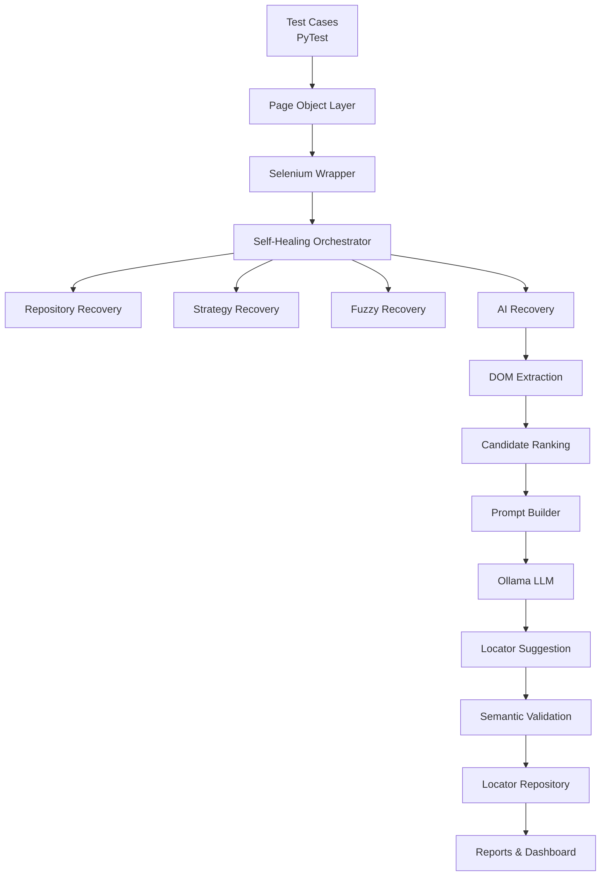

# SentinelAI Framework

Enterprise AI-Powered Self-Healing Test Automation Framework

An enterprise-grade Selenium automation framework built with Python, PyTest, Page Object Model (POM), AI-powered Self-Healing using Ollama LLM, Allure Reporting, and automatic locator repository learning.

---

# Project Overview

This framework demonstrates how traditional Selenium automation can be enhanced using AI-assisted locator recovery.

Instead of failing immediately when a locator changes, the framework attempts multiple recovery strategies before failing:

1. Repository Recovery
2. Strategy Recovery
3. Fuzzy Matching
4. AI Recovery (Local Ollama LLM)

Successful recoveries are automatically learned and stored inside the locator repository for future executions.

---

# Key Features

- Python + Selenium + PyTest
- Page Object Model (POM)
- AI Self-Healing using Ollama
- Local LLM (No OpenAI API required)
- Automatic Locator Repository
- Multi-layer Recovery Strategy
- Healing Dashboard
- Allure Reporting
- Screenshot Capture
- Prompt & AI Response Capture
- Recovery Statistics
- Automatic Repository Learning
- HTML Healing Dashboard
- JSON Healing Logs
- Extensible Architecture

---

# Architecture

# 🏛 Enterprise Layered Architecture

The framework follows a clean layered architecture that separates business logic, automation logic, AI recovery, infrastructure, and reporting.



## Layer Responsibilities

| Layer | Responsibility |
|--------|----------------|
| Test Layer | Business test scenarios implemented using PyTest |
| Page Object Layer | Encapsulates page-specific business operations |
| Selenium Wrapper | Common Selenium utilities, waits, and driver interactions |
| Self-Healing Orchestrator | Coordinates recovery engines sequentially |
| Repository Recovery | Uses previously learned locators |
| Strategy Recovery | Applies predefined locator transformation rules |
| Fuzzy Recovery | Finds similar elements using heuristic matching |
| AI Recovery | Uses Ollama LLM to suggest replacement locators |
| Validation Layer | Verifies AI-generated locators before use |
| Repository Layer | Automatically stores successful recoveries |
| Reporting Layer | Generates Allure reports, healing logs, and dashboards |

## Architecture Highlights

- Layered Enterprise Design
- Separation of Concerns
- Plug-and-Play Recovery Engines
- AI as Last Recovery Option
- Automatic Repository Learning
- Modular and Extensible Framework# 📦 Technology Stack

| Technology | Purpose |
|------------|----------|
| Python | Programming Language |
| Selenium | UI Automation |
| PyTest | Test Framework |
| Allure | Reporting |
| Ollama | Local AI Model |
| Llama 3.1 | AI Locator Recovery |
| JSON | Locator Repository |
| HTML | Healing Dashboard |
| Git | Version Control |
| Page Object Model | Framework Design |

# 🚀 Features

This framework provides enterprise-grade automation capabilities with built-in self-healing intelligence.

## UI Automation

- Selenium WebDriver
- Page Object Model (POM)
- Explicit Waits
- Centralized Locator Management
- Custom Logger
- Data Driven Testing
- PyTest Framework
- Cross-browser support
- Screenshot capture
- Allure Reporting

---

## Self-Healing Engine

The framework automatically recovers from broken locators without changing test scripts.

Recovery Pipeline

1. Repository Recovery
2. Strategy Recovery
3. Fuzzy Matching Recovery
4. AI Recovery (Ollama LLM)

If one recovery engine fails, the framework automatically proceeds to the next engine.

---

## AI Powered Recovery

The AI engine uses a locally running Ollama Large Language Model.

Workflow

Broken Locator
        ↓
DOM Extraction
        ↓
Candidate Ranking
        ↓
Prompt Generation
        ↓
Ollama
        ↓
AI Locator Suggestion
        ↓
Locator Validation
        ↓
Semantic Validation
        ↓
Repository Update
        ↓
Test Continues

---

## Automatic Learning

Whenever AI successfully heals a locator,

- locator_repository.json is updated automatically
- Future executions use Repository Recovery first
- AI is called only when required

This creates a continuously improving automation framework.

---

## Healing Dashboard

Every recovery event is captured.

The framework automatically generates

- Healing Log
- Healing Dashboard (HTML)
- Locator Repository
- AI Prompt
- AI Response

These artifacts are attached to the Allure Report after execution.

---

## Logging

The framework provides multiple logging layers.

- Console Logger
- Custom Logger
- Healing Logger
- AI Prompt Logging
- AI Response Logging

This makes debugging simple and transparent.

---

## Reports

The framework generates

- PyTest HTML Report
- Allure Report
- Healing Dashboard
- Healing Log
- Screenshots
- AI Prompt
- AI Response

---

## Design Principles

The framework follows

- SOLID Principles
- Separation of Concerns
- Page Object Model
- Factory Pattern
- Strategy Pattern
- Repository Pattern
- Enterprise Folder Structure
- Plug-and-Play Recovery Engines

# 📂 Project Structure

```
Enterprise-SelfHealing-Framework/
│
├── core/
│   ├── config.py
│   ├── driver_factory.py
│   ├── selenium_wrapper.py
│   └── base_page.py
│
├── pages/
│   ├── HomePage.py
│   ├── SignUpPage.py
│   ├── ProductPage.py
│   ├── CheckoutPage.py
│   ├── PaymentPage.py
│   ├── PaymentPageAIDemo.py
│   └── ...
│
├── tests/
│   ├── ui/
│   │   ├── test_login.py
│   │   ├── test_checkout.py
│   │   ├── test_ai_self_healing.py
│   │   └── ...
│   │
│   └── api/
│
├── repository/
│   └── locator_repository.json
│
├── reports/
│   ├── healing_dashboard.html
│   ├── healing_log.json
│   ├── report.html
│   └── screenshots/
│
├── utils/
│   │
│   ├── ai/
│   │   ├── ai_factory.py
│   │   ├── ai_session.py
│   │   ├── candidate_ranker.py
│   │   ├── dom_extractor.py
│   │   ├── ollama_client.py
│   │   ├── ollama_provider.py
│   │   ├── prompt_builder.py
│   │   └── ...
│   │
│   ├── healing/
│   │   ├── healing_base.py
│   │   ├── repository_recovery.py
│   │   ├── strategy_recovery.py
│   │   ├── fuzzy_recovery.py
│   │   ├── ai_recovery.py
│   │   ├── recovery_validator.py
│   │   └── repository_updater.py
│   │
│   ├── allure_helper.py
│   ├── healing_dashboard.py
│   ├── healing_logger.py
│   ├── locator_repository.py
│   ├── customLogger.py
│   └── data_loader.py
│
├── testdata/
│   ├── customer.json
│   ├── payment.json
│   └── config.json
│
├── requirements.txt
├── pytest.ini
├── README.md
└── .gitignore
```

---

# 📁 Folder Description

| Folder | Purpose |
|---------|----------|
| **core** | Framework core components such as driver initialization, configuration, and Selenium wrapper |
| **pages** | Page Object Model implementation for all application pages |
| **tests** | Test cases organized by UI and API modules |
| **repository** | Self-learning locator repository automatically updated after successful recoveries |
| **reports** | All generated reports including Allure artifacts, healing dashboard, logs, and screenshots |
| **utils/ai** | AI engine responsible for DOM extraction, prompt generation, Ollama communication, and locator suggestion |
| **utils/healing** | Self-healing engine implementations including Repository, Strategy, Fuzzy, and AI recovery |
| **testdata** | Externalized test data used by automation scripts |

---

# 🏗 Framework Layers

The framework follows a layered architecture to ensure maintainability and scalability.

```
Test Cases
     │
     ▼
Page Objects
     │
     ▼
Selenium Wrapper
     │
     ▼
Self-Healing Engine
     │
     ▼
AI Recovery (Ollama)
     │
     ▼
Locator Repository
     │
     ▼
Reports & Dashboard
```

Each layer has a single responsibility, making the framework easy to extend and maintain.

# 🤖 AI Self-Healing Workflow

One of the key capabilities of this framework is its ability to recover automatically from broken locators using a multi-layer self-healing mechanism.

Instead of failing immediately when an element is not found, the framework attempts several recovery strategies before reporting a failure.

---

## Recovery Pipeline

```
Element Not Found
        │
        ▼
Repository Recovery
        │
        ▼
Strategy Recovery
        │
        ▼
Fuzzy Recovery
        │
        ▼
AI Recovery (Ollama)
        │
        ▼
Semantic Validation
        │
        ▼
Repository Learning
        │
        ▼
Continue Test Execution
```

---

## Recovery Layers

### 1. Repository Recovery

The framework first checks the local locator repository.

If a previously healed locator exists, it is reused immediately without invoking AI.

**Benefits**

- Fastest recovery
- No AI overhead
- Continuous learning

---

### 2. Strategy Recovery

If repository recovery fails, the framework applies predefined locator transformation strategies.

Examples include:

- ID → Name
- Name → CSS
- CSS → XPath
- XPath simplification

---

### 3. Fuzzy Recovery

If strategy recovery fails, similar DOM elements are identified using fuzzy matching techniques.

The framework compares:

- Tag names
- Attributes
- Visible text
- Similarity score

---

### 4. AI Recovery (Ollama)

When all conventional recovery mechanisms fail, the framework invokes a locally hosted Ollama Large Language Model.

The AI receives:

- Broken locator
- Current page title
- Current URL
- Ranked DOM candidates

It then suggests the most appropriate replacement locator.

---

# AI Recovery Pipeline

```
Broken Locator
        │
        ▼
DOM Extraction
        │
        ▼
Candidate Ranking
        │
        ▼
Prompt Builder
        │
        ▼
Ollama (Llama 3.1)
        │
        ▼
Locator Suggestion
        │
        ▼
Locator Validation
        │
        ▼
Semantic Validation
        │
        ▼
Repository Update
        │
        ▼
Continue Test
```

---

# Candidate Ranking

Instead of sending the entire page source to the LLM, the framework extracts only the most relevant DOM fragments.

This reduces:

- Prompt size
- Response time
- LLM hallucinations

The ranking process considers:

- Broken locator attributes
- Tag similarity
- Nearby DOM elements
- Visible text relevance
- Element hierarchy

Only the highest-ranked candidates are included in the AI prompt.

---

# Semantic Validation

An AI-generated locator is never accepted blindly.

Before using it, the framework verifies that the recovered element matches the intended target.

Validation checks include:

- Element existence
- Element visibility
- HTML tag consistency
- Expected button or link text
- Prevention of unrelated matches

Only validated locators are accepted.

---

# Automatic Repository Learning

Once AI successfully recovers a locator, the framework automatically updates the local locator repository.

Example:

```
Original Locator
↓

AI Recovered Locator
↓

Validation Successful
↓

locator_repository.json Updated
```

During future executions, the updated locator is retrieved directly from the repository without requiring another AI call.

This creates a continuously improving automation framework.

---

# Why Local Ollama?

The framework uses a locally hosted Ollama model instead of cloud-based AI services.

Advantages include:

- No API costs
- Data remains on the local machine
- Offline execution
- Faster response after model warm-up
- Suitable for enterprise environments with strict security requirements

# 📊 Reporting & Observability

The framework provides detailed execution reports and self-healing analytics.

---

## Allure Report

The framework automatically attaches:

- Test execution screenshots
- Healing Log
- Locator Repository
- Healing Dashboard
- AI Prompt
- AI Response
- Recovered Locator
- Recovery Engine
- Execution steps

Example:

```
Test Started
     │
     ▼
Screenshot
     │
     ▼
Broken Locator
     │
     ▼
AI Recovery
     │
     ▼
Recovered Locator
     │
     ▼
Healing Log
     │
     ▼
Order Placed
```

---

## Healing Dashboard

After every execution, the framework generates a visual dashboard.

The dashboard includes:

- Total healing events
- Repository recoveries
- Strategy recoveries
- Fuzzy recoveries
- AI recoveries
- Recent healing history

Generated file:

```
reports/
    healing_dashboard.html
```

---

## Healing Log

Every successful recovery is recorded in JSON format.

Example:

```json
{
  "timestamp": "2025-07-22 10:31:05",
  "original": [
    "xpath",
    "//button[@id='submit']"
  ],
  "recovered": [
    "xpath",
    "//button[@data-qa='pay-button']"
  ],
  "source": "AI",
  "confidence": 95,
  "provider": "Ollama",
  "duration_ms": 1240
}
```

---

## Locator Repository

The framework continuously learns.

Recovered locators are automatically stored inside:

```
repository/
    locator_repository.json
```

Future executions reuse these locators before invoking AI.

This significantly reduces execution time and AI dependency.

---

# ▶ Running the Framework

## Install Dependencies

```bash
pip install -r requirements.txt
```

---

## Start Ollama

Ensure Ollama is installed and the required model is available.

Example:

```bash
ollama serve
```

Verify the model:

```bash
ollama list
```

---

## Execute Tests

Run all tests:

```bash
pytest
```

Run AI Self-Healing test:

```bash
pytest tests/ui/test_ai_self_healing.py
```

Generate HTML report:

```bash
pytest --html=reports/report.html
```

Generate Allure results:

```bash
pytest --alluredir=allure-results
```

Generate Allure report:

```bash
allure serve allure-results
```

---

# ⚙ Prerequisites

- Python 3.11+
- Selenium
- Chrome Browser
- ChromeDriver
- PyTest
- Allure
- Ollama
- Llama 3.1 model

---
# 📸 Sample Outputs

The framework automatically generates the following execution artifacts.

## Allure Report

- Test execution steps
- Screenshots
- Recovery Engine
- AI Prompt
- AI Response
- Healing Log
- Locator Repository
- HTML Dashboard

---

## Healing Dashboard

The dashboard provides an overview of framework learning.

Metrics include:

- Total Healing Events
- Repository Recoveries
- Strategy Recoveries
- Fuzzy Recoveries
- AI Recoveries
- Recent Healing History

---

## Locator Repository

The framework continuously learns successful recoveries.

Example:

```json
{
  "xpath://button[@id='submit']": {
    "current_locator": [
      "xpath",
      "//button[@data-qa='pay-button']"
    ],
    "source": "AI",
    "success_count": 4
  }
}
```

---

# 💡 Key Achievements

This framework demonstrates several enterprise automation capabilities:

- AI-assisted Selenium Self-Healing
- Local LLM integration using Ollama
- Automatic Repository Learning
- Layered Recovery Pipeline
- Semantic Locator Validation
- Enterprise Reporting
- Modular Architecture
- Page Object Model implementation
- JSON Repository Management
- Continuous Framework Learning

---

# 🚀 Future Enhancements

Potential future improvements include:

- Parallel Execution using Selenium Grid
- Docker-based Execution
- Jenkins / GitHub Actions CI Integration
- Multi-browser Execution
- Visual AI Validation
- AI Confidence Scoring
- Repository Versioning
- Recovery Analytics Dashboard
- Automatic Locator Optimization
- AI-assisted Test Generation

---

# 👨‍💻 Author

**A K Senthil Kumar**

Automation Test Engineer | Python | Selenium | PyTest | AI-powered Test Automation

This project was developed as a proof-of-concept enterprise automation framework demonstrating AI-assisted Selenium Self-Healing using a locally hosted Ollama Large Language Model.

---

# 📄 License

This project is intended for learning, demonstration, and portfolio purposes.
